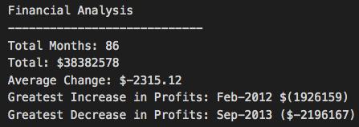
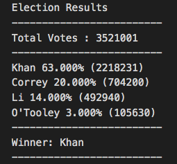

# Python Homework - Py Me Up, Charlie

## PyBank

* In this challenge, I was tasked with creating a Python script for analyzing the financial records of your company. A set of financial data called [PyBank/Resources/budget_data.csv](PyBank/Resources/budget_data.csv) was given. The dataset is composed of two columns: `Date` and `Profit/Losses`.

* The task is to create a Python script that analyzes the records to calculate each of the following:

  * The total number of months included in the dataset
  * The net total amount of "Profit/Losses" over the entire period
  * The average of the changes in "Profit/Losses" over the entire period
  * The greatest increase in profits (date and amount) over the entire period
  * The greatest decrease in losses (date and amount) over the entire period

* The result looks as follows:

## PyPoll

* In this challenge, I was tasked with helping a small, rural town modernize its vote-counting process. 

* A set of poll data called [election_data.csv](PyPoll/Resources/election_data.csv) was given. The dataset is composed of three columns: `Voter ID`, `County`, and `Candidate`. Your task is to create a Python script that analyzes the votes and calculates each of the following:

  * The total number of votes cast
  * A complete list of candidates who received votes
  * The percentage of votes each candidate won
  * The total number of votes each candidate won
  * The winner of the election based on popular vote.

* The result looks as follows:
